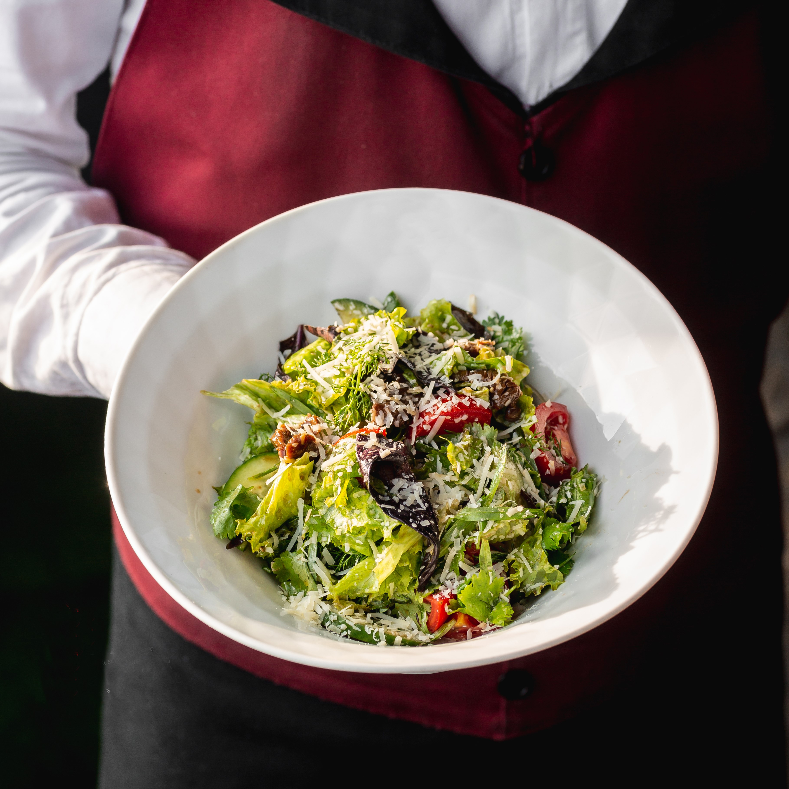

# Menu

## Przystawka

|Lp. | **Przystawka** | cena |
|----|-----------------------------------------------------------------------------------------|-----------|
|1.  |**Focaccia** (z oliwą bazyliową, posypana suszonymi pomidorami z czosnkiem) | 18 zł |
|2.  |**Focaccia serowa** (z mozzarellą i scamorzą, posypana suszonymi pomidorami z czosnkiem) | 20 zł |
|3.  |**Bruschetta crudo 3 szt.** (szynka parmeńska, mozzarella, salsa pomidorowa z czosnkiem i bazylią, rukola) | 25 zł |

## Pizza klasyczna

|Lp. | **Pizza** | 30 cm | 50 cm | 60 cm |
|----|-----------------------------------------------------------------------------------------|-----------|------------|------------|  
|1.  |**Margherita** (sos pomidorowy, mozzarella) | 18 zł | 25 zł | 35 zł |
|2.  |**Capriciosa** (ciasto, sos pomidorowy, ser, szynka, pieczarki, oregano) | 20 zł | 30 zł | 40 zł |
|3.  |**Parma** (ciasto, sos pomidorowy, ser mozzarella, szynka dojrzewająca, bazylia świeża, oregano) | 25 zł | 35 zł | 45 zł |
|4.  |**Campione** (ciasto, sos pomidorowy, ser, szynka, kabanosy, boczek wędzony, salami, oregano) | 28 zł | 38 zł | 48 zł |
|5.  |**Decoro** (ciasto, sos pomidorowy, ser, szynka, pieczarki, papryka konserwowa, czosnek, oregano) | 28 zł | 38 zł | 48 zł |
|6.  |**Napoletana** (ciasto, sos pomidorowy, ser, salami, oliwki zielone, papryczki jalapenos, oregano) | 32 zł | 42 zł | 52 zł |
|7.  |**Piacere** (ciasto, ser, sos pomidorowy, salami, boczek wędzony, cebula biała, kukurydza, oregano) | 30 zł | 40 zł | 50 zł |
|8.  |**Roma** (ciasto, sos pomidorowy, ser, salami, kabanosy, papryka konserwowa, oregano) | 30 zł | 40 zł | 50 zł |
|9.  |**Wiejska** (ciasto, sos pomidorowy, ser, kiełbasa, ogórki konserwowe, cebula biała, czosnek, oregano) | 30 zł | 40 zł | 50 zł |
|10. |**Pepperoni** (ciasto, sos pomidorowy, ser, salami pepperoni, oregano) | 28 zł | 38 zł | 48 zł |
|11. |**Hawaii** (ciasto, sos pomidorowy, ser, szynka, ananasy, oregano) | 28 zł | 38 zł | 48 zł |
|12. |**Prosciutto** (ciasto, sos pomidorowy, ser, szynka włoska, pomidory koktajlowe, rukola, oregano) | 32 zł | 42 zł | 52 zł |

## Pizza Wegetariańska

|Lp. | **Pizza Wege** | 30 cm | 50 cm |  60 cm |
|----|-----------------------------------------------------------------------------------------|-----------|------------|------------| 
|1.  |**Margherita** (ciasto, sos pomidorowy, mozzarella) | 18 zł | 25 zł | 35 zł |
|3.  |**Quattro formaggi** (ciasto, sos z pomidorów pelati, mozzarella Cammino D'Oro, Taleggio D.O.P., scamorza, ser emilgrana) | 28 zł | 38 zł | 48 zł |
|4.  |**Spinaci** (ciasto, sos z pomidorów pelati, mozzarella, szpinak, czosnek, ser emilgrana) | 28 zł | 38 zł | 48 zł |
|5.  |**Vegana** (ciasto, sos z pomidorów pelati, oliwki, zapieczone pomidorki cherry, czosnek, kapary, listki bazylii) | 28 zł | 38 zł | 48 zł |
|6.  |**Napoletana** (ciasto, sos pomidorowy, ser, salami, oliwki zielone, papryczki jalapenos, oregano) | 32 zł | 42 zł | 52 zł |

## Pizza In Bianco

|Lp. | **Pizza In Bianco** | 30 cm | 50 cm |
|----|---------------------------------------------------------------------------------------------------------|-----------|------------|
|1.  |**Pizza Carbonara** (ciasto, sos śmietanowy, ser, boczek, pieczarki, cebula) | 28 zł | 35 zł |
|2.  |**Pizza Verona** (ciasto, sos śmietanowy, ser, szpinak, czosnek, pomidor, ser gorgonzola) | 30 zł | 38 zł |
|3.  |**Pizza Bazyliowa** (ciasto, sos śmietanowy, mozzarella, szpinak, pomidory koktajlowe, parmezan, pesto bazyliowe) | 32 zł | 40 zł |
|4.  |**Pizza Kurkowa** (ciasto, sos śmietanowy, mozzarella, kurczak, kurki, czerwona cebula) | 38 zł | 45 zł |

## Makarony

|Lp. | **Makaron** |  cena  |
|----|---------------------------------------------------------------------------------------------------------------------------------------------------|------------|
|1.  |**Spaghetti Bolognese** (z włoskimi pomidorami pelati, mięsem wołowym, mięsem wieprzowym, warzywami, oliwą extra vergine, oregano i serem Grana Padano) | 45 zł |
|2.  |**Spaghetti Carbonara** (z policzkiem wieprzowym Guanciale, jajkiem, serem Grana Padano i serem Pecorino Romano) | 42 zł |
|3.  |**Tagliatelle z kurczakiem** (nduja, gorgonzola, białe wino, szalotka, pomidorki cherry, mascarpone, grana padano, rukola) | 42 zł |
|4.  |**Lasagne** (sos boloński, beszamel, mozzarella, grana padano) | 38 zł |

## Sałatki

|Lp. | **Sałatki** |  cena  |
|----|---------------------------------------------------------------------------------------------|------------|
|1.  |**Sałatka Cezar** (grillowany filet z kurczaka, sałata rzymska, jajko, pomidor, płatki sera emilgrana, sos Cezar, grzanki) |  32 zł |
|2.  |**Grillowany kurczak z dressingiem jogurtowym** (melon, pomidor, ogórek, czerwona cebula, granat, ananas, mix sałat, bułeczki naszej produkcji) |  36 zł |
|3.  |**Kozi ser z sosem vinegrette** (ogórek, gruszka, pomidor, orzechy włoskie, pomarańcza, konfitura z figi, miód, bułeczki naszej produkcji) |  34 zł |
|4.  |**Grillowane hallumi z sosem vinegrette** (pomidor, ogórek, rzodkiewka, ananas, piklowana cebula, cebula dymka, mix sałat, bułeczki naszej produkcji) |  36 zł |

## Desery

|Lp. | **Desery** |  cena  |
|----|---------------------------------------------------------------------------------------------|------------|
|1.  |**Tiramisu** (klasyczny włoski kawowy deser) |  18 zł |
|2.  |**Sernik pistacjowy** (na zimno, na kruchym spodzie z pistacją, malinami i opalaną bezą) |  23 zł |
|3.  |**Panna Cotta** (z sosem malinowym i świeżymi malinami) |  18 zł |
|4.  |**Brownie** (podawane z wiśniami na ciepło z cynamonem oraz owocem sezonowym) |  23 zł |

## Soki i napoje

|Lp. | **Soki i napoje** |  ml  |  cena  |
|----|---------------------------------------------------------------------------------------------|------------|------------|
|1.  |**Woda mineralna** (pamiętaj o nawodnieniu!) |  300 ml |  FREE |
|2.  |**Świeżo wyciskany sok pomarańczowy**  |  200 ml |  20 zł |
|3.  |**Lemoniada klasyczna** (domowa lemoniada na wodzie gazowanej, z cytryną, limonką, miętą i rozmarynem) |  300 ml |  18 zł |
|4.  |**Lemoniada malinowa** (domowa lemoniada na wodzie gazowanej, z malinami i rozmarynem) |  300 ml |  18 zł |
|5.  |**Lemoniada lawendowa** (domowa lemoniada na wodzie gazowanej, z lawendą i rozmarynem) |  300 ml |  18 zł |

## Kawy

|Lp. | **Kawy** |  cena  |
|----|---------------------------------------------------------------------------------------------|------------|
|1.  |**Espresso** | 12 zł |
|2.  |**Flat White**  |  15 zł |
|3.  |**Americano**  |  13 zł |
|4.  |**Cappuccino** |  15 zł |
|5.  |**Caffè Latte** |  17 zł |
|5.  |**Iced Latte** (Mrożona wersja Caffè Latte przygotowana na kostkach lodu) |  22 zł |
|7.  |**Iced Americano** (Mrożona wersja Americano przygotowana na kostkach lodu) |  20 zł |
|8.  |**Cold Brew Latte** (Mleczna, delikatna w smaku kawa na kostkach lodu) |  22 zł |
|9.  |**Pistachio Latte** (Delikatnie słodka, aromatyczna, pistacjowa kawa latte z bitą śmietaną i posypką z kruszonych pistacji) |  18 zł |
|10. |**Caffe Frappé** (Klasyczna kawa mrożona, zblendowana z kostkami lodu, delikatnie słodka) |  18 zł |

